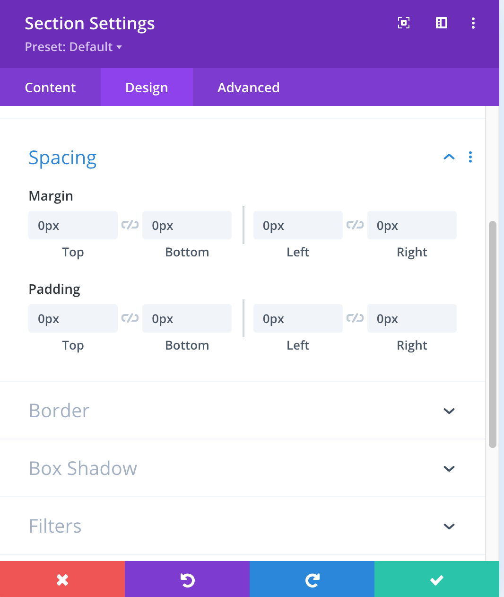
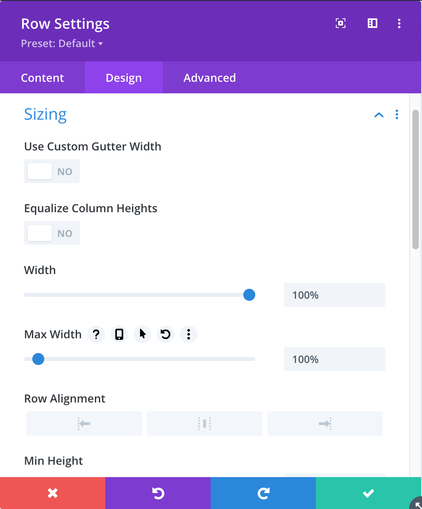
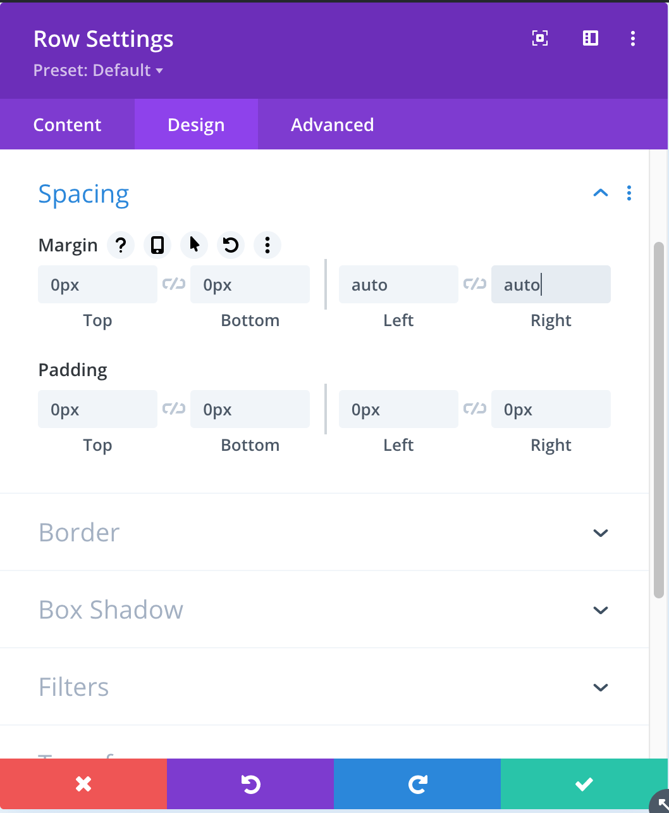

# Návod – moduly Divi

Popis a postup jak pracovat s custom moduly v Divi na webech easylingo.com.

Všechny naše nové moduly začínají na `Easy` a tak je možné je snadno najít při volbě modulu. Jsou normálně s ostatními moduly v nabídce.

## Obecně

### Zobrazení v administraci

Některé moduly se nezobrazují kompletně správně v administraci. I když je to lepší než bylo. Něco je dané tím že jsem nevěděl jak na to a někde je to dané tím že modul je ovládán javascriptem.

Hlavička například ukazuje vše, kromě menu, kde jsou jen ID menu. Tady to dodělám později už vím jak na to.

Testimonials se zobrazují pod sebe místo vedle sebe, je to dané javascriptem.

**Ale zobrazení na frontendu je v pořádku!**

Také se zobrazí varovaní na konci toho okna `Settings` modulu. Oranžový blok s textem. Je to jen varování a až bude dokumentace tak se to opraví.

### Vložení modulu do stránky

Zatím všechny moduly jsou na celou šířku a je proto potřeba nastavit jak sekci tak řádek v Divi kam se modul vkládá.

U **sekce** (modrá barva) je potřeba nastavit `Spacing` takto:

Jak `Margin` tak `Padding` nastavit na 0.

U řádku nastavit takto `Sizing` a `Spacing`:

**Sizing** – `Width` a `Max Width` na 100%.

**Spacing** – `Margin` i `Padding` na 0px, kromě `Margin left` a `Margin right`, ty nastavit na auto.

A do této řádky už normálně vložíme modul (černé +).

### Easy Header

Slouží pro tvorbu hlavičky. Nastavuje se hlavní menu a user menu. Přepínání jazyků bude už v modulu. Přibude tu brzo URL odkazu z loga.

### Easy Footer

Patička stránky. Nastavují se názvy menu a jejich ID ale také obsah těch dvou bloků, nadpis pod bloky a text a URL buttonu.

Co se týká obsahu bloků, je ideální vkládat tyto dvě položky jako `Text`. Pokud použijeme úpravy ve `Visual` tak se automaticky text obalí tagem `
`. Jde vymazat v `Text` ale je tam vidět jen někdy. Jinak vznikne mezera mezi nadpisem bloku a tímto textem.

### Easy Top Block Homepage

Omlouvám se za název, ale je to ten blok kde vlevo je text a buttony a vpravo zatím prázdno.

Není tedy dokončený. Zatím se zadává Nadpis, Obsah, a Texty a URL k buttonům.

### Easy Top Top Block

Zase sorry za název pak změním. Je to ten nový blok se třemi odrážkami které se přepínají. A je tam i přepínač Desktop / Mobil.

Zadávají se nadpisy, obsah a vždy mobulní obrázek a desktop obrázek.

URL obrázků je potřeba zadat ručně, ale už umím udělat přímo výběr obrázku. Jako je to u Testimoniálů. Tady se zatím musí zadat URL obrázku z Médií. Doporučuji otevřít nový tab s obrázky a kopírovat URL.

### Easy Testimonials

Zadává se nejprve nadpis celého bloku. A pak jednotlivé položky jak je zvykem v Divi.

U položky už funguje výběr Avatara standardně, není potřeba kopírovat URL obrázku.

> Tento plugin jsem udělal jen díky prozkoumání kódů Divi, zatím neexistuje žádná dokumentace pro přidávání položek. Pokud by něco nefungovalo prosím hned hlaste!
