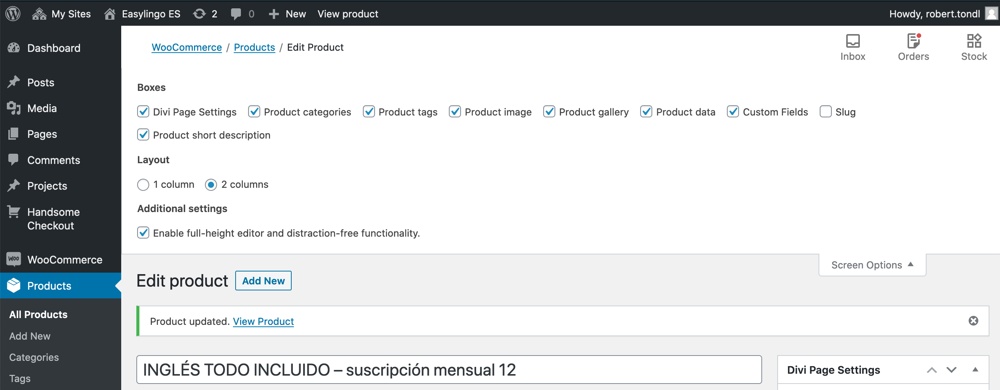
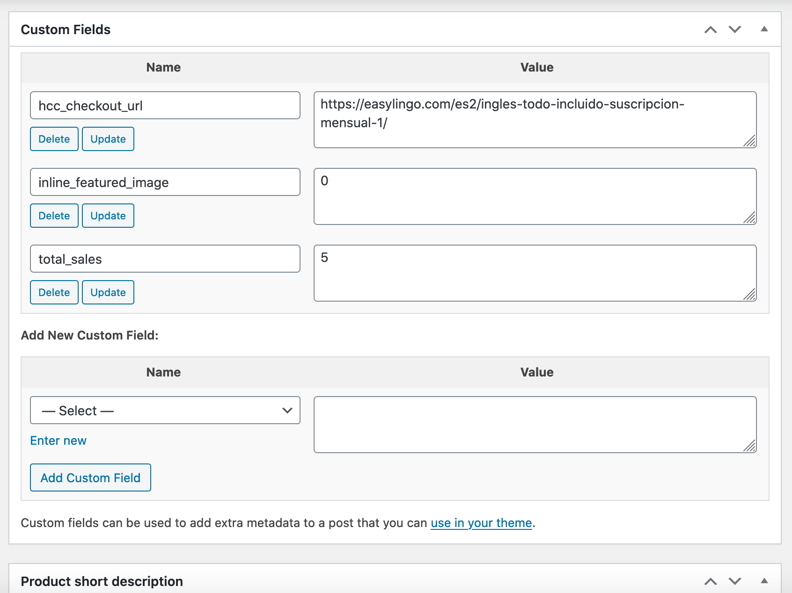
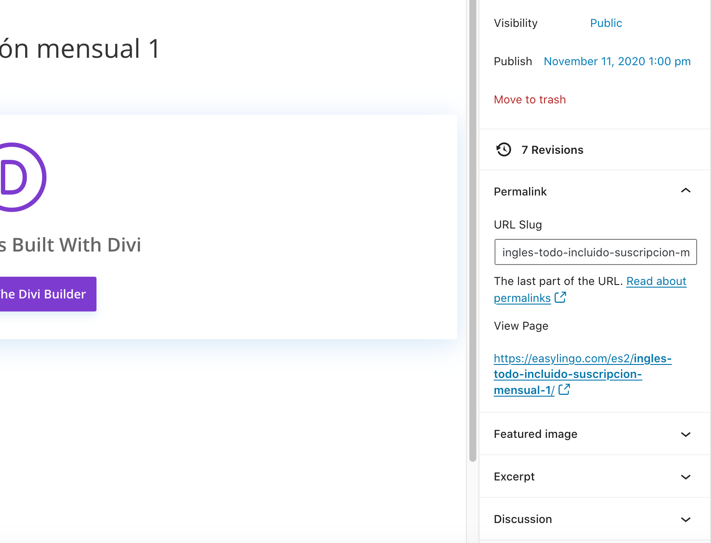

# Nastavení produktů pro vazbu na aplikaci a studovnu

Tento návod popisuje systém tvorby SKU a nastavení objednávkové stránky u produktů.

## Popis

Pro správné fungování nákupu produktů z aplikace a studovny jsou nutné dvě věci:

1. správné nastavení **SKU** u produktu
2. přidání **uživatelského pole** s URL objednávkové stránky

## SKU

SKU produktu se skládá ze dvou částí – ID z Ruby a počtu měsíců předplataného nebo znak `a` pro jednorázový nákup.

### Tvar SKU:

`id-měsíce` nebo `id-a` pro jednorázový nákup. Znak `-` je krátká pomlčka / znak mínus. Nepoužívejte dlouhý spojovník apod!;

Znamená to tedy že vždy bude více produktů se stejnou první částí SKU, které se budu lišit jen počtem měsíců předplatného ve druhé části za pomlčkou.

### Příklady

ID = 100, předplatné na 6 měsíců: `100-6`
ID = 100, předplatné na 1 měsíc: `100-1`
ID = 100, jednorázový nákup: `100-a`

## Uživatelské pole

Ke každému produktu je nutné přidat uživatelské pole `hcc_checkout_url` s hodnotou URL objednávkové stránky s formulářem.

Nejprve se ujistěte že máte zobrazena už. pole. Jděte do editace produktu a vysuňte si lištu vpravo nahoře `screen option`. A zaškrtněte `Custom fields`:

Pak se vám u produktu zobrazí uživatelská pole. Jsou dole pod nastavením produktu:

Pole `hcc_checkout_url` je už zadáno na ES. Ale u ostaních bude zase potřeba ho vytvořit. Pokud existuje, je v rozbalovacím menu `Select`. Pak stačí ho vybrat a do pole `Value` zadáme URL, viz. níže.

Pokud není v rozbalovací menu tak klikneme na `Enter new` a název pole vyplníme hodnotou `hcc_checkout_url` a zase do `Value` URL objednávkové stránky.

### URL

Jako URL do pole `Value` dáme permalink stránky s formulářem.

### Příklad

`https://easylingo.com/es2/ingles-todo-incluido-suscripcion-mensual-1/`
